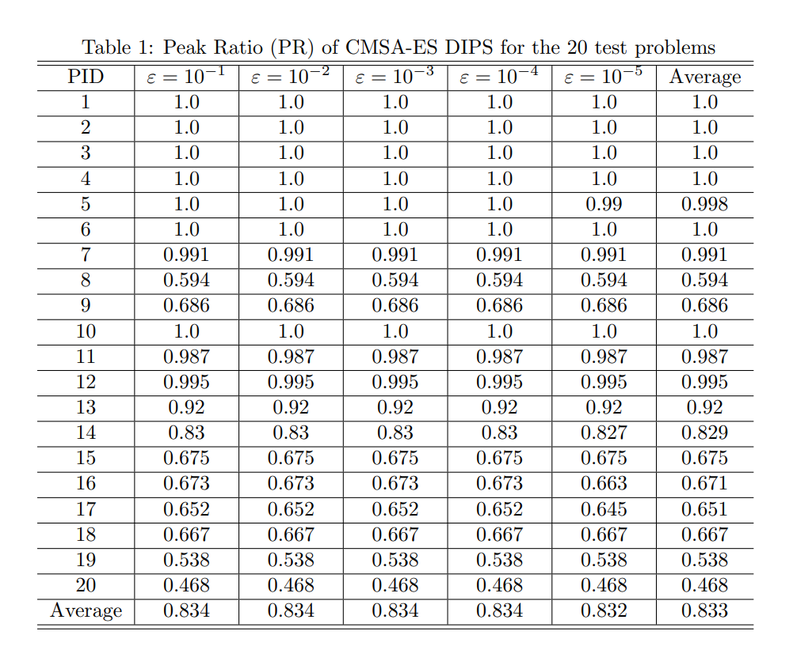
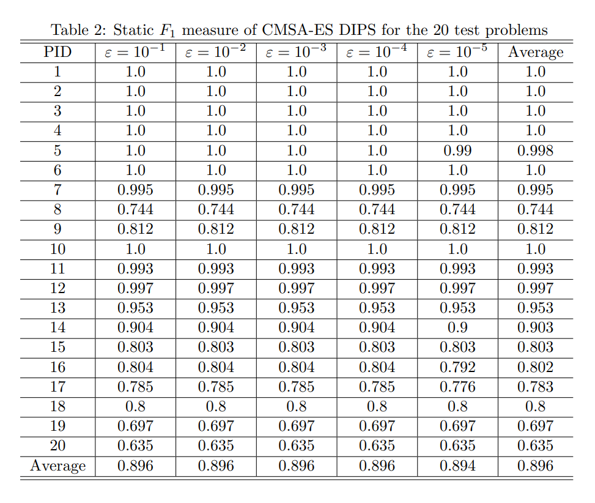
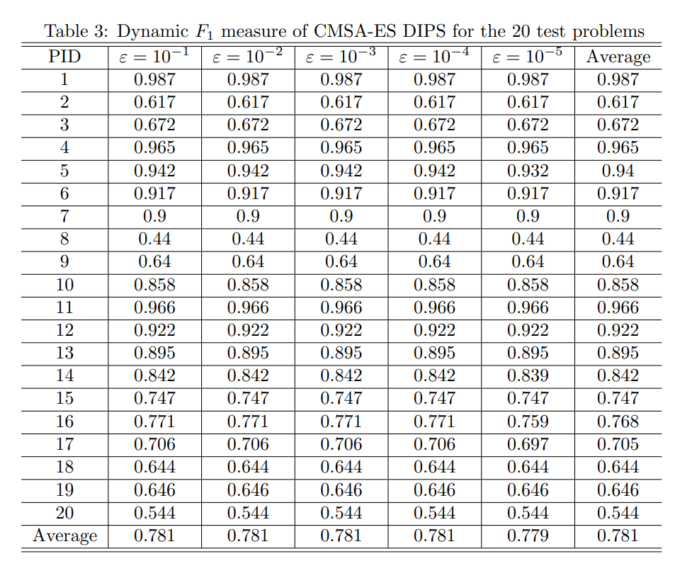

## CMSA-ES DIPS
The Covariance Matrix Self-Adaption Evolution Strategy with Dynamic Initial Population Selection (CMSA-ES DIPS) is a two-stage niching method. In the first stage, the initial population is divided into multiple clusters by Hill-Valley Clustering (HVC), and in the second stage, the CMSA-ES with dynamic initial population selection is used as core search algorithm.

## Experimental Results
Table 1 shows the obtained Peak Ratio (PR) of 20 test functions at different accuracy levels. Table 2 and table 3 are static F1 measure and dynamic F1 measure respectively.

